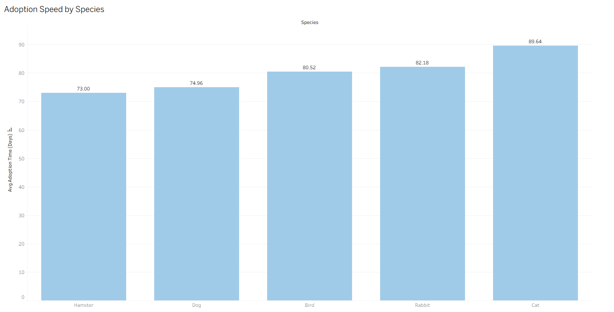
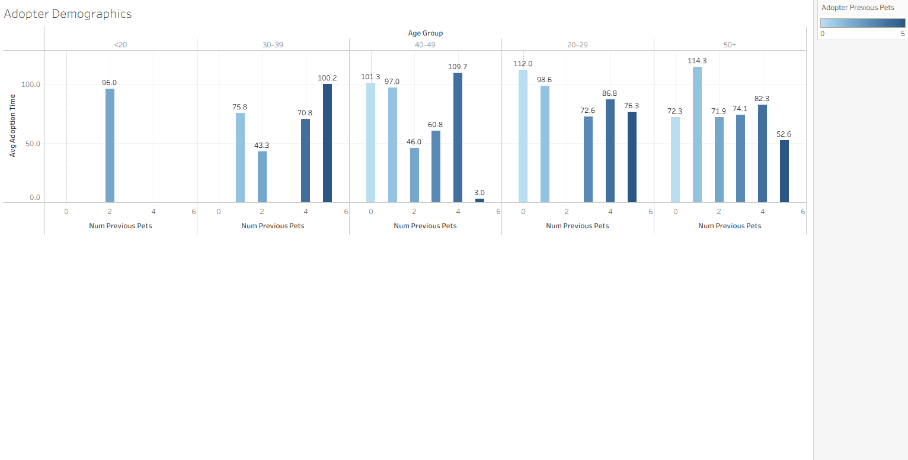
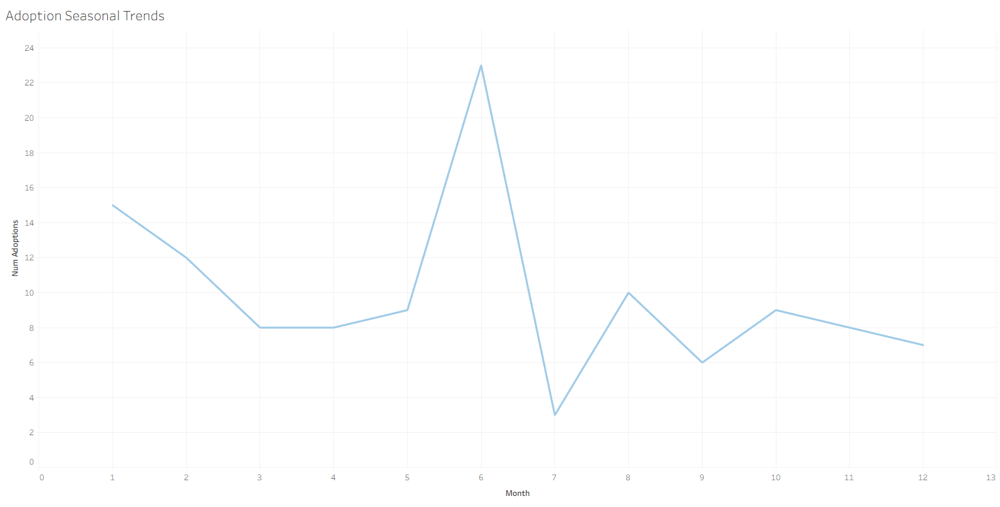
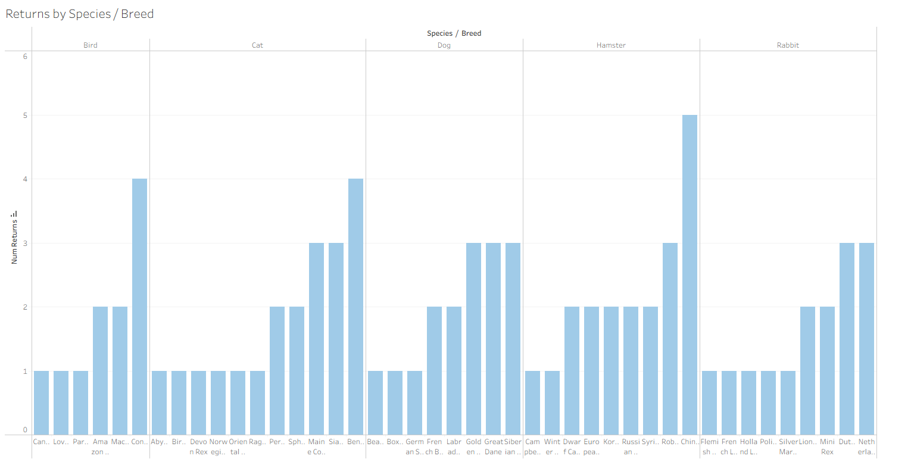

# Pet Adoption Analysis
**Project Overview:**  
Analyzed historical pet adoption data from an animal shelter to identify trends and recommend strategies to improve adoption outcomes. Worked independently over three weeks to clean and analyze the dataset in SQL, focusing on adoption timing, adopter behavior, and pet characteristics. Visualized findings in Tableau to surface actionable insights aimed at helping the shelter enhance marketing efforts, optimize intake planning, and better align pets with potential adopters.
- **Tools:** SQL (MySQL), Tableau, Excel/CSV
- **Original Dataset**: [Pet Adoption Records on Kaggle](https://www.kaggle.com/datasets/chaudharisanika/pet-adoption-records-with-animal-and-adopter-data)
- **Keywords:** adoption trends, pet return risk, segmentation, seasonal analysis, data storytelling, SQL analysis

## Business Question 
How can this shelter improve pet adoption rates and optimize the adoption process using animal and adopter data?

## Supporting Questions
- What types of pets are adopted most quickly?
- Which adopter demographics are associated with faster adoptions?
- Are there seasonal or regional patterns in adoption rates?
- What factors are associated with unsuccessful or delayed adoptions?

## Key Insights & Recommendations
### 1. **Adoption Speed by Pet Type**
- **Insight**: Hamsters are adopted the fastest; Cats are the slowest.
- **Recommendation**: Investigate ways to boost visibility for under-adopted pet types like cats. Seasonal campaigns or targeted features (e.g., "Adopt-a-Cat Week") could be tested.

  
### 2. **Adopter Demographics**
- **Insight**: Adopters aged **30+** with prior pet experience adopt pets faster.
- **Recommendation**: Consider targeting outreach to experienced adopters through loyalty or referral programs. This group may be more ready to adopt and retain pets.

### 3. **Seasonal Adoption Trends**
- **Insight**: Peak adoptions occur in **June**, followed by **January** and **August**.
- **Recommendation**: Align major adoption drives and marketing campaigns with these seasonal peaks. Explore why demand spikes in summer and early winter.

### 4. **Pet Returns**
- **Insight**: Cats and Dogs of certain high-maintenance breeds are returned more often.
- **Recommendation**: Explore post-adoption support programs for these breeds. Consider pre-adoption education or matching pets more carefully with adopter lifestyles.
 

Visualizations can be found in the [tableu](tablaeu) folder or on [Tableau Public](https://public.tableau.com/views/pet_adoption_data/ImprovingPetAdoptionOutcomesInsightsbyAdopterDemographics?:language=en-US&:sid=&:redirect=auth&:display_count=n&:origin=viz_share_link)

## Business Value
This analysis helps animal shelters:
- Promote under-adopted pets with targeted campaigns
- Segment adopter outreach based on behavior and experience
- Time campaigns strategically with seasonal trends
- Reduce returns by improving post-adoption support and better match pets with adopters

## Tools and Skills Used
- SQL (MySQL): Data segmentation and time-based analysis
- Tableau: Data visualization and dashboard creation
- Excel / CSV: Data cleaning and preparation

## Folder Structure
- [data](data): Contains both the original and cleaned datasets used in the analysis
- [sql](sql): Contains queries used for analysis
- [tableu](tablaeu): Contains all exported Tableau visualizations
